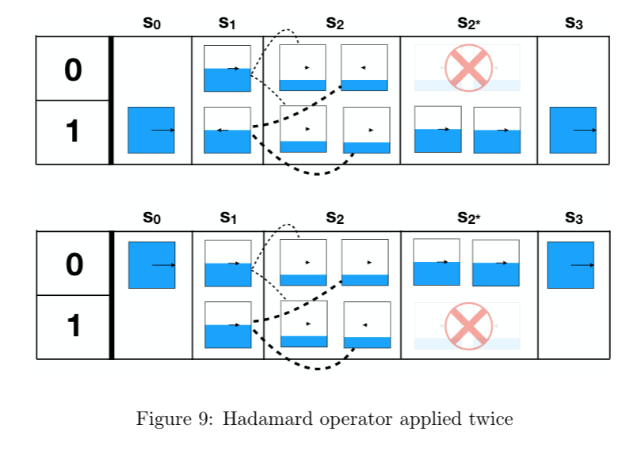
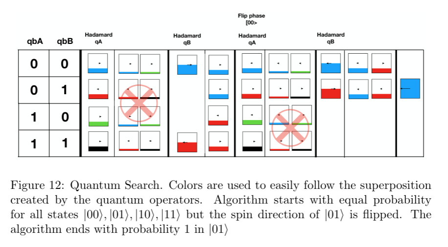
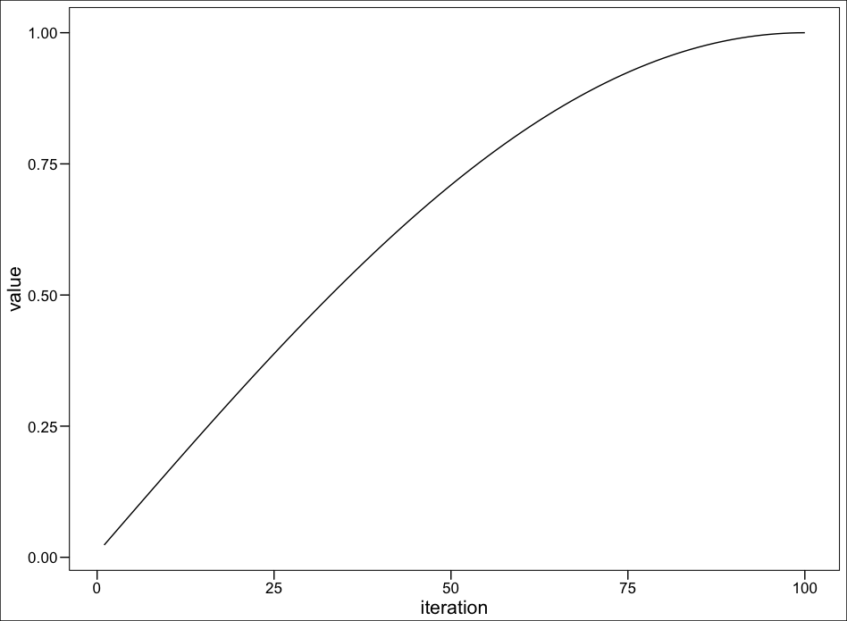

# A Quantum System simulation with Rcpp

A simple Quantum System in CPP through Rcpp interface. The code is based on the marvellous implementation of ["Quantum Computer Gate Playground"](http://davidbkemp.github.io/quantum-gate-playground/).

A brief introduction to *Quantum Computing* can be found [here](pdf/tbd.pdf). This article provides a brief introduction to the main concepts and operations on a Quantum Computing. All concepts are mainly based on [Quantum Computing since Democritus](https://www.amazon.es/Quantum-Computing-since-Democritus-Aaronson/dp/0521199565) and these [lectures notes](https://cs.uwaterloo.ca/~watrous/CPSC519/LectureNotes/all.pdf).

## Quantum system based on S4 Objects

S4 objects are use in order to create a simple class to define a Quantum System with a vector representing qBits and one [Hadamard gate](https://en.wikipedia.org/wiki/Quantum_logic_gate#Hadamard_(H)_gate) to operate on the system itself.

```r
setClass (
  # Class name
  "QuantumSystem",

  # Defining slot type
  representation (
    qbitVector = "numeric",
    hadamardGate= "numeric"
  ),

  # Initializing slots
  prototype = list(
    qbitVector = NULL,
    hadamardGate = NULL)
)
```

From C code, we can direclty interact with S4 objects, for instance:

```c
S4 init_system(int nQubits) {
  // Creating an object of QuantumSystem class
  S4 x("QuantumSystem");
  ....
  x.slot("hadamardGate") = ....;
  return(x);
}
```

and also from R i easy to interact with S4 objects

```r
quaSys <- init_system(nQubits = 1)
quaSys@hadamardGate
```

## Fast lineal agebra with RcppArmadillo

As long as operations on qBits can be simulated by means of matrix operations, [RcppArmadillo](https://cran.r-project.org/web/packages/RcppArmadillo/index.html) provides an optimized way to applied optimized matrix operations. For instance, a *n-times* kron operation can be applied as follows:

```c
  //Kronecker tensor product
  for(int i=0; i<nQubits-1; i++) {
    Htimes = arma::kron(Htimes, H);
  }
```

## Simple interaction with the quantum system

1. Init the quantum system 
```r
# Init quantum system
quaSys <- init_system(nQubits = 1)
```

2. System's meassurement (system collapses)
```r
meassurement(quaSys)
# Notice the collapse produced
quaSys@qbitVector
```

3. Apply Hadamard gate (quantum interferance)
```r
# Check qbit states
firstQbits <- quaSys@qbitVector
applyHadamard(quaSys) # Apply Hadamard gate
secondQbits <- quaSys@qbitVector
applyHadamard(quaSys) # Apply Hadamard gate
# Check superpositions
assertthat::assert_that(all(firstQbits != secondQbits))
assertthat::are_equal(firstQbits, quaSys@qbitVector)
```

Note the *quantum interferance* effect, when Hadamard gate is applied twice, as follows:




## Quantum search on two qBits system

The next figure graphically represents, how using operations provided in this simulator one state can be searched. Concepts like Hadamard gates, phase flip or quantum cancellation are used.




## An example of Grover’s algorithm

As example, Grover's algorithm is implemented following the next pseudocode:


```r
# Init quantum system
quaSys <- init_system(nQubits = 13)
# Grover's search
for (i in seq(100)){
  # Set target through oracle function
  applyOracleFunction(quaSys, target = 1022)
  # Apply hadamard
  applyHadamard(quaSys)
  # Apply difusion
  applyDifussion(quaSys)
  # Apply hadamard
  applyHadamard(quaSys)
}
```

The next figure shows how the probability on the target qBit is higer in each iteration:


